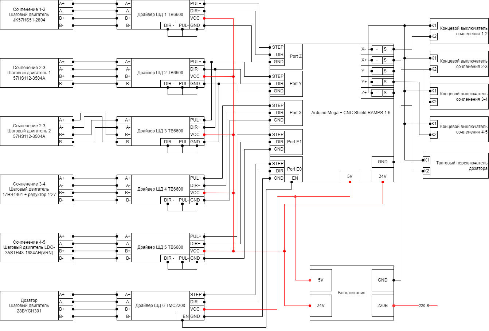

Электроника
============

Схема подключения компонентов
______________________________

Список компонентов
___________________

Перечень деталей для сборки электроники представлен в таблице.

.. csv-table:: Детали для сборки электроники
   :header: "Номер", "Наименование", "Количество"
   :widths: 10, 10, 10

   1, "Блок питания 24В и 5В", 1

   2, "Драйвер ШД TB6600", 5

   3, "Драйвер ШД TMC2208", 1

   4, "Комплект проводов и разъемов для пайки и подключения", 1

   5, "Контроллер Arduino Mega", 1

   6, "Концевой выключатель", 4

   7, "Плата расширения CNC shield RAMPS 1.6", 1

   8, "Тактовый переключатель", 1

   9, "Шаговый двигатель JK57HS51-2804", 1

   10, "Шаговый двигатель 57HS112-3504A", 2

   11, "Шаговый двигатель 17HS4401 + редуктор 1:27", 1

   12, "Шаговый двигатель LDO-35STH48-1684AH(VRN)", 1

   13, "Шаговый двигатель 28BYGH301", 1

