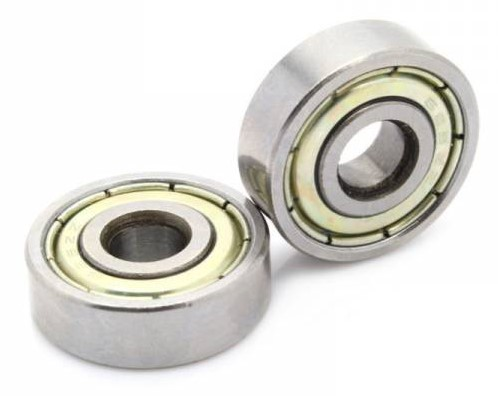
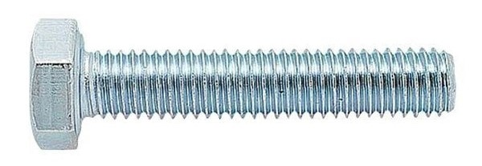

Детали для закупки
=========================

.. |pic1| image:: _static/Pictures/parts_list/Р1.jpg
       :scale: 20%

.. |pic2| image:: _static/Pictures/parts_list/Р2.jpg
       :scale: 10 %

.. |pic4| image:: _static/Pictures/parts_list/Р4.jpg
       :scale: 20 %

.. |pic5| image:: _static/Pictures/parts_list/Р5.jpg
       :scale: 20 %

.. |pic7| image:: _static/Pictures/parts_list/Р7.jpg
       :scale: 10%

.. |pic8| image:: _static/Pictures/parts_list/Р8.jpg
       :scale: 10 %

.. |pic9| image:: _static/Pictures/parts_list/Р9.jpg
       :scale: 10 %

.. |pic10| image:: _static/Pictures/parts_list/Р10.jpg
       :scale: 9 %

.. |pic11| image:: _static/Pictures/parts_list/Р11.jpg
       :scale: 20 %

.. |pic12| image:: _static/Pictures/parts_list/Р12.jpg
       :scale: 25 %

.. |pic13| image:: _static/Pictures/parts_list/Р13.jpg
       :scale: 20 %

.. |pic14| image:: _static/Pictures/parts_list/Р14.jpg
       :scale: 15 %

.. |pic15| image:: _static/Pictures/parts_list/Р15.jpg
       :scale: 15 %

.. |pic16| image:: _static/Pictures/parts_list/Р16.jpg
       :scale: 20 %

.. |pic17| image:: _static/Pictures/parts_list/Р17.jpg
       :scale: 10 %       

.. csv-table:: Список деталей
   :header: "Номер", "Наименование", "Количество", "Изображение"
   :widths: 20, 10, 30, 30

   2, "Винт M5x16 цилиндрическая головка под шестигранник", 8, |pic1|

   3, "Втулка М5x8 вплавляемая", 8, |pic2|

   4, "Подшипник 16x5x5 радиальный", 8, |pic3|

   5, "Подшипник 22x8x7 радиальный", 2, |pic4|

   6, "Шайба М5x10x1", 8, |pic5|

   2, "Винт М8x75 шестигранная головка", 1, |pic6|

   3, "Втулка М3x6 вплавляемая", 1, |pic7|

   4, "Втулка М4x10 вплавляемая", 6, |pic8|

   5, "Гайка М8 со стопором", 1, |pic9|

   3, "Винт М3x45 цилиндрическая головка под шестигранник", 2, |pic1|

   4, "Винт М4x25 цилиндрическая головка под шестигранник", 2, |pic1|

   5, "Винт М4x30 цилиндрическая головка под шестигранник", 2, |pic1|

   6, "Винт М5x16 цилиндрическая головка под шестигранник", 8, |pic1|

   7, "Втулка М4x10 вплавляемая", 4, |pic2|

   8, "Втулка М5x8 вплавляемая", 8, |pic2|

   9, "Подшипник 13x4x5.3 радиальный", 6, |pic3|

   10, "Подшипник 22x8x7 радиальный", 2, |pic4|

   11, "Шаговый двигатель NEMA 23 57HS112-3504A", 2, |pic10|

   12, "Шкив 27Т5-14", 2, |pic11|

   5, "Вал стальной 8x136", 1, |pic12|

   6, "Винт M3x10 цилиндрическая головка под шестигранник", 6, |pic1|

   7, "Винт M3x30 потайная головка под шестигранник", 2, |pic1|

   8, "Винт M4x60 цилиндрическая головка под шестигранник", 6, |pic1|

   9, "Втулка M3x6 вплавляемая", 2, |pic2|

   10, "Гайка М4", 6, |pic13|

   11, "Ремень Т5 ширины 16мм длины 440мм", 2, |pic14|

   6, "Винт M3x10 цилиндрическая головка под шестигранник", 4, |pic1|

   6, "Винт M3x45 цилиндрическая головка под шестигранник", 1, |pic1|

   7, "Винт M4x20 цилиндрическая головка под шестигранник", 1, |pic1|

   8, "Винт M4x25 цилиндрическая головка под шестигранник", 2, |pic1|

   8, "Винт M4x55 цилиндрическая головка под шестигранник", 3, |pic1|

   9, "Втулка M4x4 вплавляемая", 1, |pic2|

   9, "Втулка M4x10 вплавляемая", 3, |pic2|

   10, "Гайка М4", 3, |pic13|

   9, "Подшипник 13x4x5.3 радиальный", 3, |pic3|

   10, "Подшипник 22x8x7 радиальный", 2, |pic4|

   11, "Шкив 27Т5-14", 1, "-"

   12, "Шаговый двигатель NEMA 17 17HS4401 (+ редуктор 1:27)", 1, |pic15|

   1, "Винт T8 с шагом 1мм длиной 56мм", 1, |pic16|

   2, "Винт M2.5x10 потайная головка", 4, |pic17|

   3, "Винт M3x10 потайная головка", 7, |pic17|

   4, "Винт M3x20 потайная головка", 4, |pic17|

   5, "Втулка M3x4 вплавляемая", 2, |pic2|

   6, "Втулка M3x6 вплавляемая", 9, |pic2|

