Список всех деталей
=========================

.. |pic1| image:: _static/Pictures/parts_list/Р1.jpg
       :scale: 20%

.. |pic2| image:: _static/Pictures/parts_list/Р2.jpg
       :scale: 10 %

.. |pic3| image:: _static/Pictures/parts_list/Р3.jpg
       :scale: 20 %

.. |pic4| image:: _static/Pictures/parts_list/Р4.jpg
       :scale: 20 %

.. |pic5| image:: _static/Pictures/parts_list/Р5.jpg
       :scale: 20 %

.. |pic6| image:: _static/Pictures/parts_list/Р6.jpg
       :scale: 20 %

.. |pic7| image:: _static/Pictures/parts_list/Р7.jpg
       :scale: 10%

.. |pic8| image:: _static/Pictures/parts_list/Р8.jpg
       :scale: 10 %

.. |pic9| image:: _static/Pictures/parts_list/Р9.jpg
       :scale: 10 %

.. |pic10| image:: _static/Pictures/parts_list/Р10.jpg
       :scale: 9 %

.. |pic11| image:: _static/Pictures/parts_list/Р11.jpg
       :scale: 20 %

.. |pic12| image:: _static/Pictures/parts_list/Р12.jpg
       :scale: 25 %

.. |pic13| image:: _static/Pictures/parts_list/Р13.jpg
       :scale: 20 %

.. |pic14| image:: _static/Pictures/parts_list/Р14.jpg
       :scale: 15 %

.. |pic15| image:: _static/Pictures/parts_list/Р15.jpg
       :scale: 15 %

.. |pic16| image:: _static/Pictures/parts_list/Р16.jpg
       :scale: 20 %

.. |pic17| image:: _static/Pictures/parts_list/Р17.jpg
       :scale: 10 %       

.. |pic18| image:: _static/Pictures/parts_list/Р18.jpg
       :scale: 25 %

.. |pic19| image:: _static/Pictures/parts_list/Р19.jpg
       :scale: 20 %

.. |pic20| image:: _static/Pictures/parts_list/Р20.jpg
       :scale: 30 %

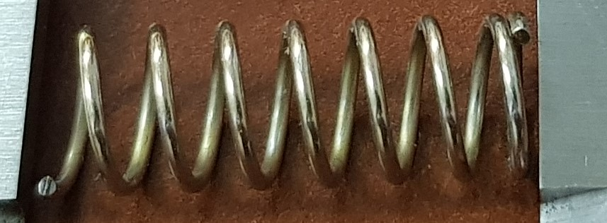

.. |pic22| image:: _static/Pictures/parts_list/Р22.jpg
       :scale: 20 %

.. |pic23| image:: _static/Pictures/parts_list/Р23.jpg
       :scale: 25 %

.. |pic24| image:: _static/Pictures/parts_list/Р24.jpg
       :scale: 20 %

.. csv-table:: Детали для закупки
   :header: "Номер", "Наименование", "Количество", "Изображение"
   :widths: 20, 10, 30, 30

   2, "Винт M5x16 цилиндрическая головка под шестигранник", 8, |pic1|

   3, "Втулка М5x8 вплавляемая", 8, |pic2|

   4, "Подшипник 16x5x5 радиальный", 8, |pic3|

   5, "Подшипник 22x8x7 радиальный", 2, |pic4|

   6, "Шайба М5x10x1", 8, |pic5|

   2, "Винт М8x75 шестигранная головка", 1, |pic6|

   3, "Втулка М3x6 вплавляемая", 1, |pic7|

   4, "Втулка М4x10 вплавляемая", 6, |pic8|

   5, "Гайка М8 со стопором", 1, |pic9|

   3, "Винт М3x45 цилиндрическая головка под шестигранник", 2, |pic1|

   4, "Винт М4x25 цилиндрическая головка под шестигранник", 2, |pic1|

   5, "Винт М4x30 цилиндрическая головка под шестигранник", 2, |pic1|

   6, "Винт М5x16 цилиндрическая головка под шестигранник", 8, |pic1|

   7, "Втулка М4x10 вплавляемая", 4, |pic2|

   8, "Втулка М5x8 вплавляемая", 8, |pic2|

   9, "Подшипник 13x4x5.3 радиальный", 6, |pic3|

   10, "Подшипник 22x8x7 радиальный", 2, |pic4|

   11, "Шаговый двигатель NEMA 23 57HS112-3504A", 2, |pic10|

   12, "Шкив 27Т5-14", 2, |pic11|

   5, "Вал стальной 8x136", 1, |pic12|

   6, "Винт M3x10 цилиндрическая головка под шестигранник", 6, |pic1|

   7, "Винт M3x30 потайная головка под шестигранник", 2, |pic1|

   8, "Винт M4x60 цилиндрическая головка под шестигранник", 6, |pic1|

   9, "Втулка M3x6 вплавляемая", 2, |pic2|

   10, "Гайка М4", 6, |pic13|

   11, "Ремень Т5 ширины 16мм длины 440мм", 2, |pic14|

   6, "Винт M3x10 цилиндрическая головка под шестигранник", 4, |pic1|

   6, "Винт M3x45 цилиндрическая головка под шестигранник", 1, |pic1|

   7, "Винт M4x20 цилиндрическая головка под шестигранник", 1, |pic1|

   8, "Винт M4x25 цилиндрическая головка под шестигранник", 2, |pic1|

   8, "Винт M4x55 цилиндрическая головка под шестигранник", 3, |pic1|

   9, "Втулка M4x4 вплавляемая", 1, |pic2|

   9, "Втулка M4x10 вплавляемая", 3, |pic2|

   10, "Гайка М4", 3, |pic13|

   9, "Подшипник 13x4x5.3 радиальный", 3, |pic3|

   10, "Подшипник 22x8x7 радиальный", 2, |pic4|

   11, "Шкив 27Т5-14", 1, "-"

   12, "Шаговый двигатель NEMA 17 17HS4401 (+ редуктор 1:27)", 1, |pic15|

   1, "Винт T8 с шагом 1мм длиной 56мм", 1, |pic16|

   2, "Винт M2.5x10 потайная головка", 4, |pic17|

   3, "Винт M3x10 потайная головка", 7, |pic17|

   4, "Винт M3x20 потайная головка", 4, |pic17|

   5, "Втулка M3x4 вплавляемая", 2, |pic2|

   6, "Втулка M3x6 вплавляемая", 9, |pic2|

   7, "Гайка М3", 4, |pic13|

   8, "Гайка T8 шаг 1", 2, |pic18|

   13, "Муфта соединительная 5x8 (длина 25мм, диаметр внешний 14мм)", 1, |pic19|

   14, "Уплотнительное кольцо 20мм внеш 2мм толщина", 1, |pic20|

   17, "Гайка T8 шаг 1", 1, |pic21|

   18, "Пружина сжатия 1х20х84х7/8 Ст70Ц", 1, |pic22|

   21, "Тактовый переключатель 6х6", 1, |pic23|

   23, "Шаговый двигатель 28BYGH301", 1, |pic24|

   1, "Блок питания 24В и 5В", 1, "-"

   2, "Драйвер ШД TB6600", 5, "-"

   3, "Драйвер ШД TMC2208", 1, "-"

   4, "Комплект проводов и разъемов для пайки и подключения", 1, "-"

   5, "Контроллер Arduino Mega", 1, "-"

   6, "Концевой выключатель", 4, "-"

   7, "Плата расширения CNC shield RAMPS 1.6", 1, "-"

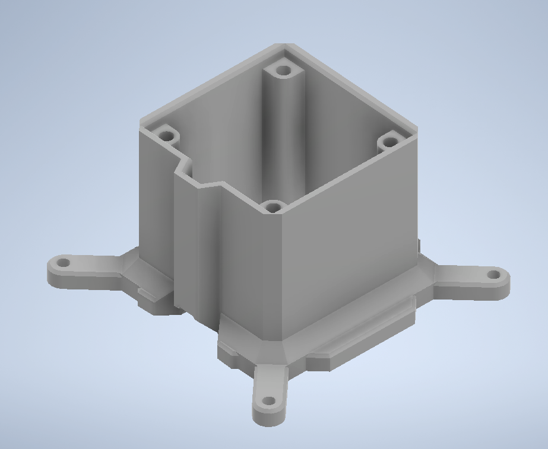

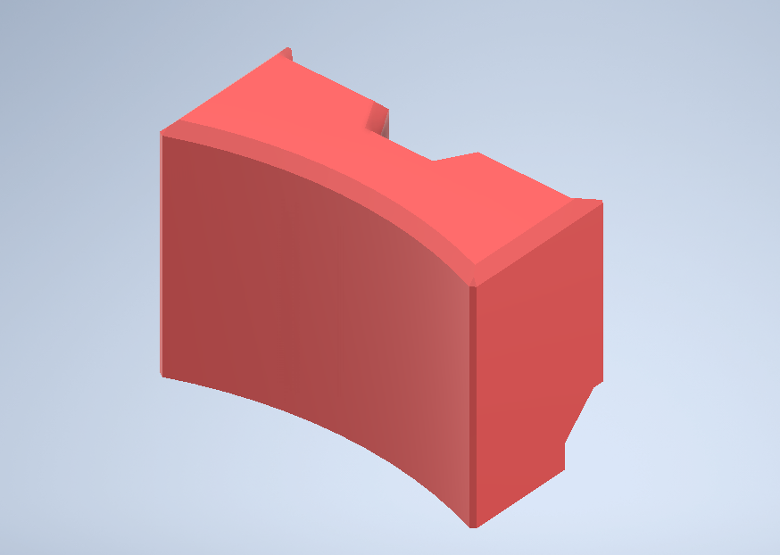

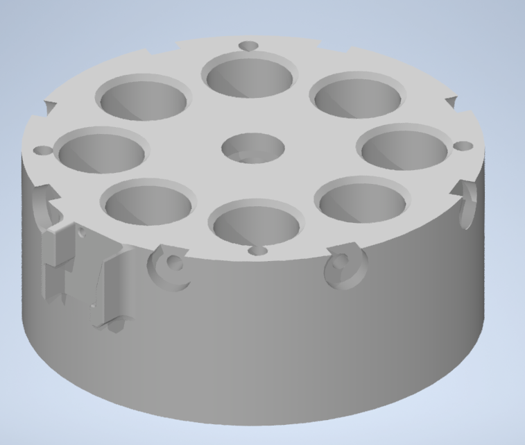

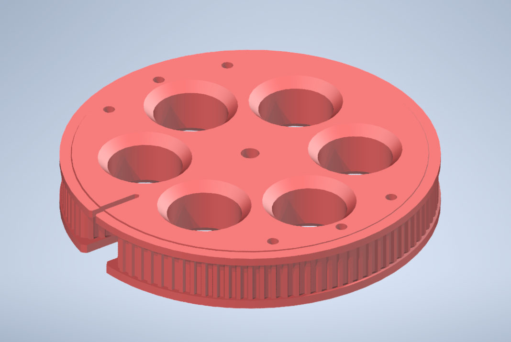

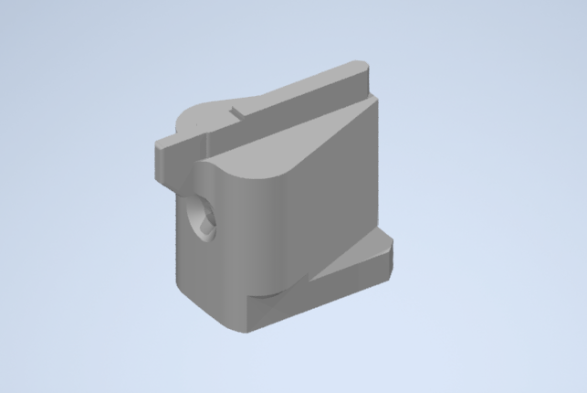

.. |pic30| image:: _static/Pictures/parts_list/Р30.jpg
       :scale: 20 %

.. |pic31| image:: _static/Pictures/parts_list/Р31.jpg
       :scale: 30 %

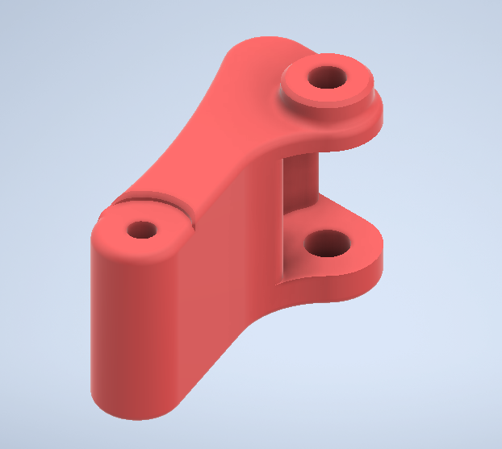

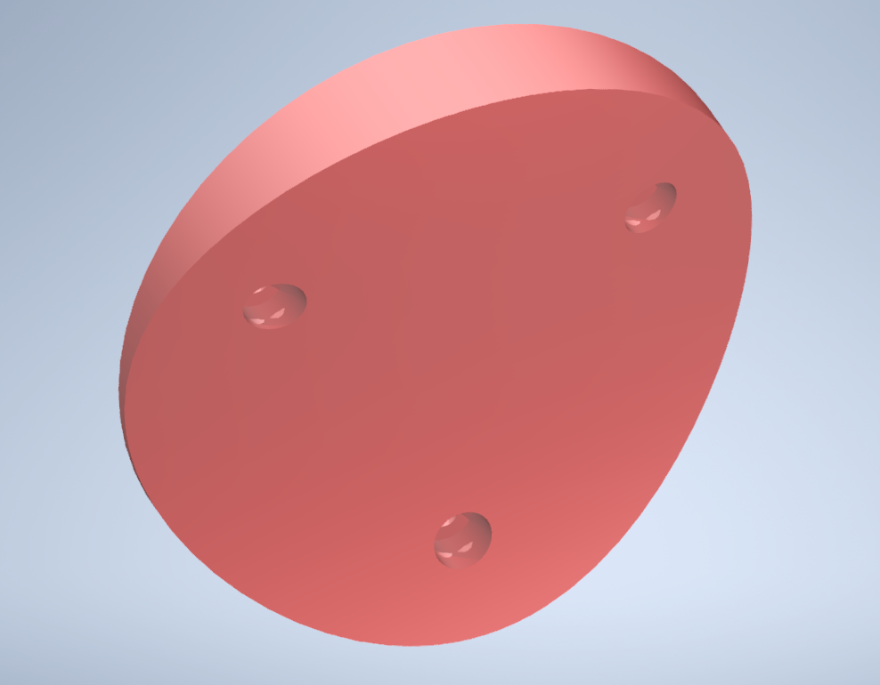

.. |pic34| image:: _static/Pictures/parts_list/Р34.jpg
       :scale: 25 %

.. |pic35| image:: _static/Pictures/parts_list/Р35.jpg
       :scale: 25 %

.. |pic36| image:: _static/Pictures/parts_list/Р36.jpg
       :scale: 20 %

.. |pic37| image:: _static/Pictures/parts_list/Р37.jpg
       :scale: 35 %

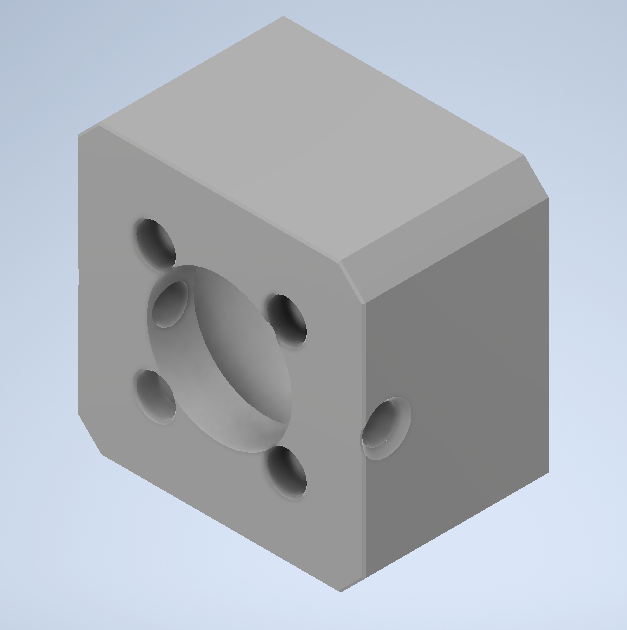

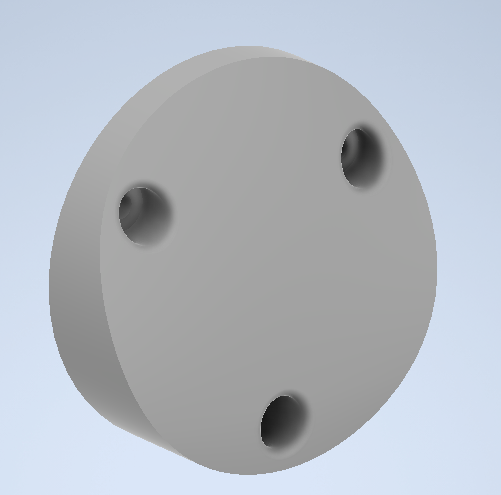

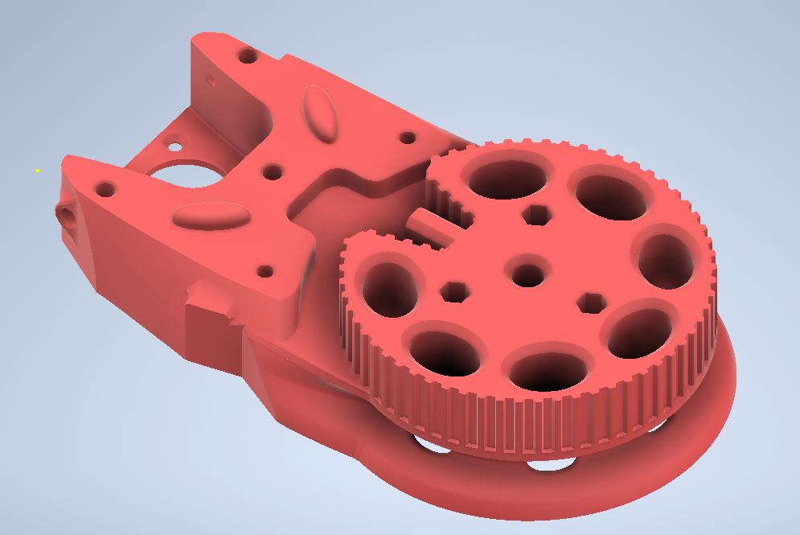

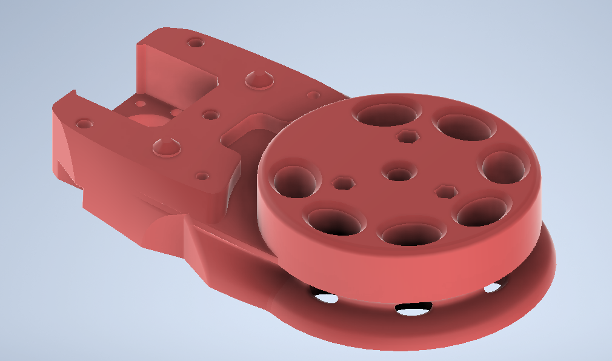

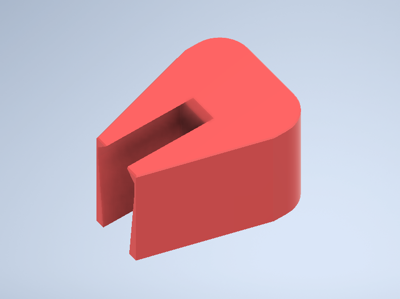

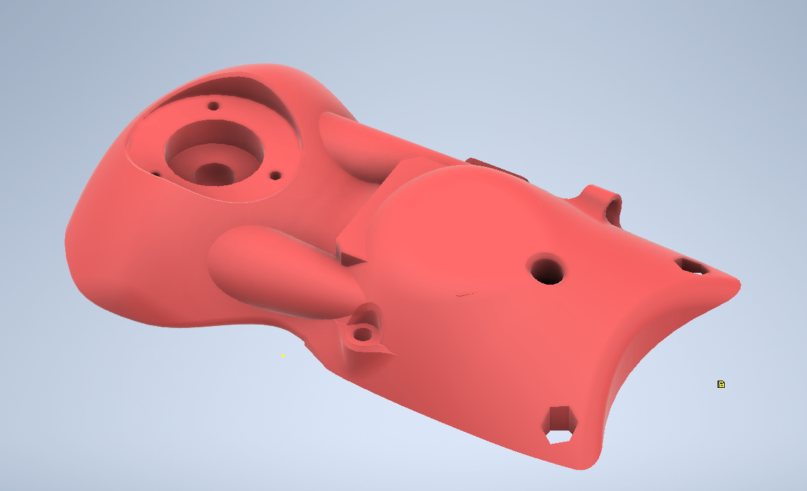

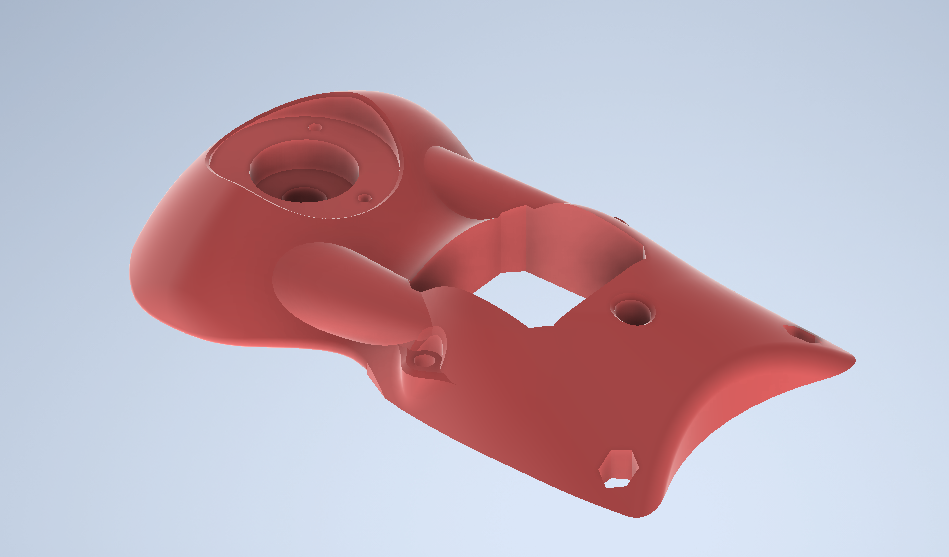

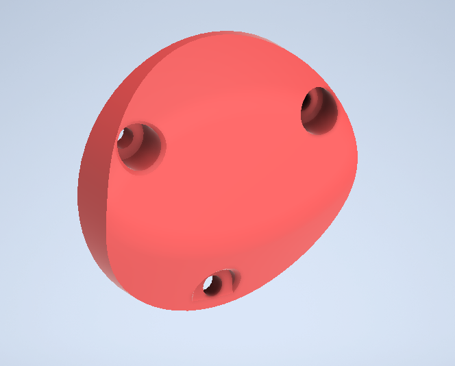

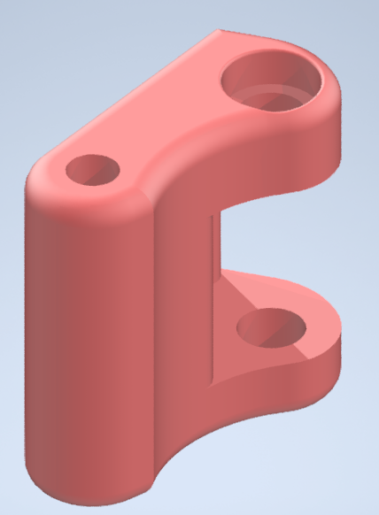

.. |pic47| image:: _static/Pictures/parts_list/Р47.jpg
       :scale: 20 %

.. |pic48| image:: _static/Pictures/parts_list/Р48.jpg
       :scale: 25 %

.. |pic49| image:: _static/Pictures/parts_list/Р49.jpg
       :scale: 25 %

.. |pic50| image:: _static/Pictures/parts_list/Р50.jpg
       :scale: 30 %

.. |pic51| image:: _static/Pictures/parts_list/Р51.jpg
       :scale: 30 %

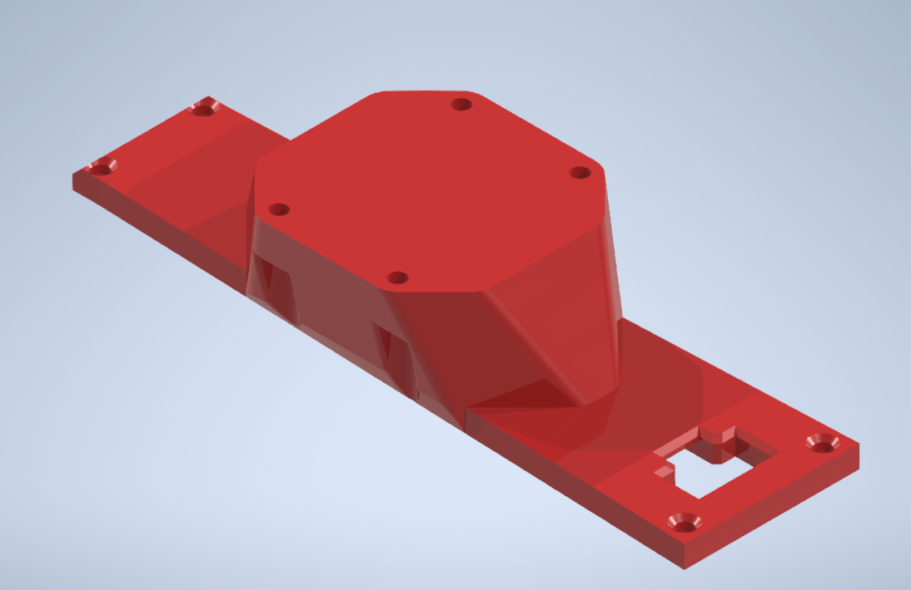

.. |pic53| image:: _static/Pictures/parts_list/Р53.jpg
       :scale: 30 %

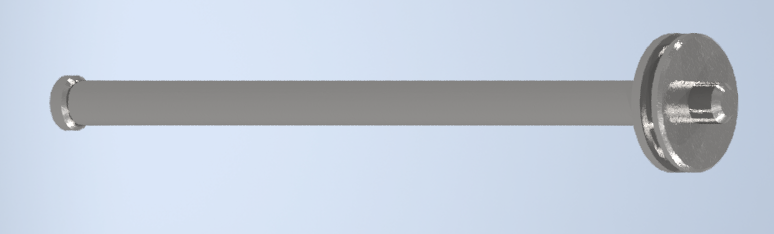

.. |pic55| image:: _static/Pictures/parts_list/Р55.jpg
       :scale: 30 %

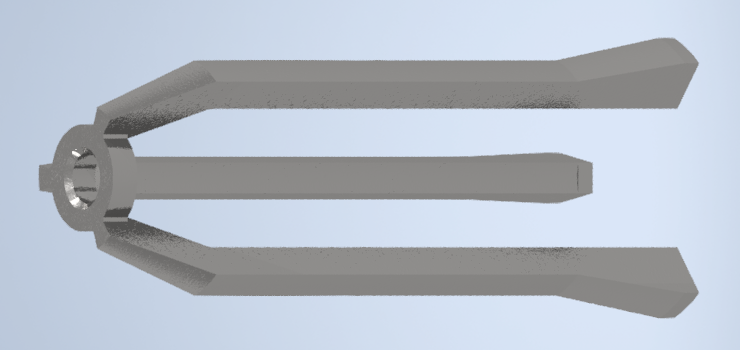

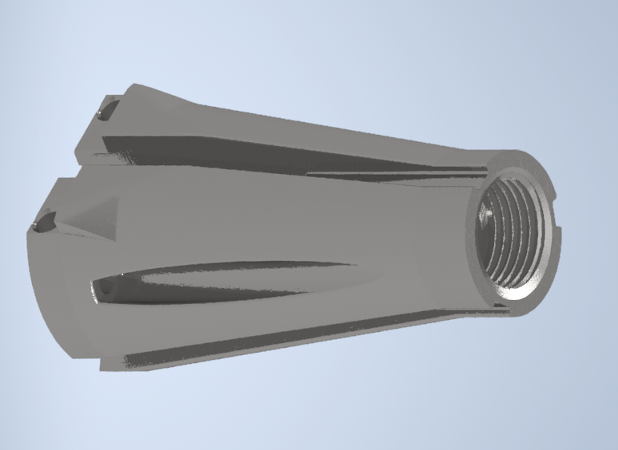

.. |pic58| image:: _static/Pictures/parts_list/Р58.jpg
       :scale: 30 %

.. |pic59| image:: _static/Pictures/parts_list/Р59.jpg
       :scale: 30 %

.. csv-table:: Детали для печати
   :header: "Номер", "Наименование", "Количество", "Изображение"
   :widths: 20, 10, 30, 30

   1, "J1 motor case", 1, |pic25|

   1, "J1 pedestal", 1, |pic26|

   1, "J1 pedestal", 1, |pic27|

   1, "J1 cogwheel p1", 1, |pic28|

   1, "J1 cogwheel p2", 1, |pic29|

   1, "J1 main", 1, |pic30|

   2, "J1 tens 1", 1, |pic31|

   2, "J1 tens 2", 1, |pic32|

   1, "J1 cap", 2, |pic33|

   2, "J2 cogwheel p1", 1, |pic34|

   3, "J2 cogwheel p2", 1, |pic35|

   4, "J2 cogwhee p3", 2, |pic36|

   1, "J2 main", 1, |pic37|

   2, "J2 motor mount", 1, |pic38|

   3, "J2 tens", 1, "-"

   3, "J2 cap", 1, |pic39|

   3, "J3 main p1", 1, |pic40|

   3, "J3 main p2", 1, |pic41|

   3, "J3 p3", 1, |pic42|

   3, "J3 fxnear 1", 1, |pic43|

   3, "J3 fxnear 2", 1, |pic44|

   3, "J3 cap", 1, |pic45|

   3, "J3Tens", 1, |pic46|

   3, "J4 p1", 1, |pic47|

   3, "J4 p1", 1, |pic48|

   3, "J4 p3", 1, |pic49|

   9, "Держатель поршня", 1, |pic50|

   10, "Корпус двигателя", 1, |pic51|

   11, "Крышка", 1, |pic52|

   12, "J2 motor mount", 1, |pic53|

   15, "Поршень", 1, |pic54|

   16, "Поршневой цилиндр", 1, |pic55|

   19, "Сбрасыватель", 1, |pic56|

   20, "Соединитель", 1, |pic57|

   22, "Толкатель поршня", 1, |pic58|

   24, "Щит сбрасывателя", 1, |pic59|