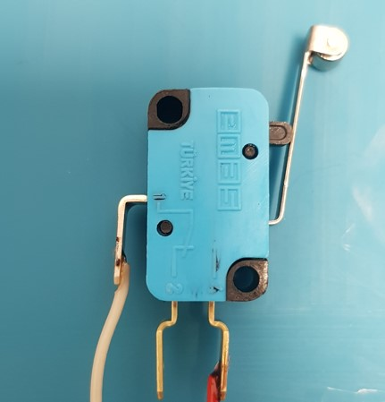
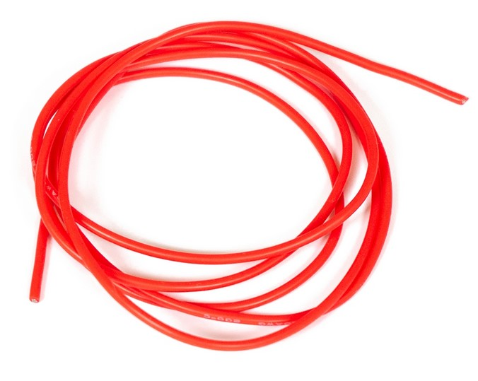
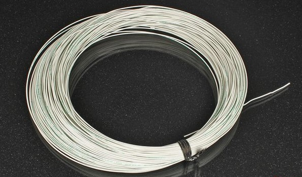
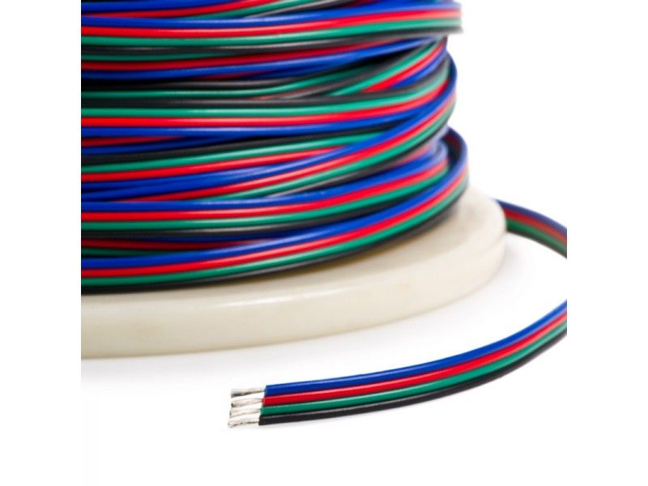
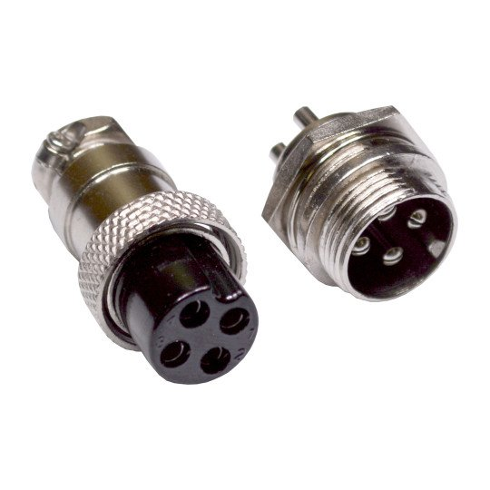
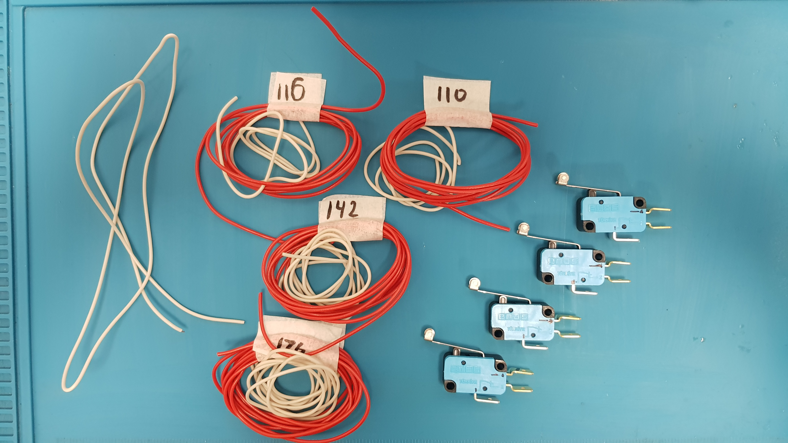
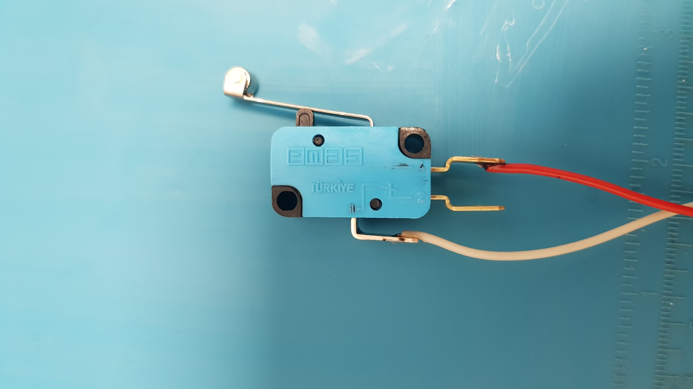
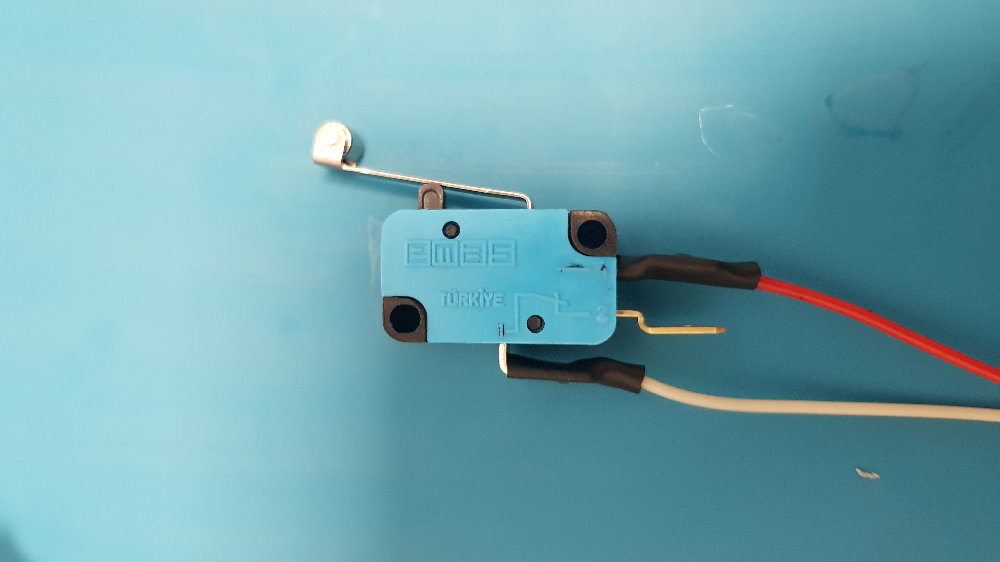
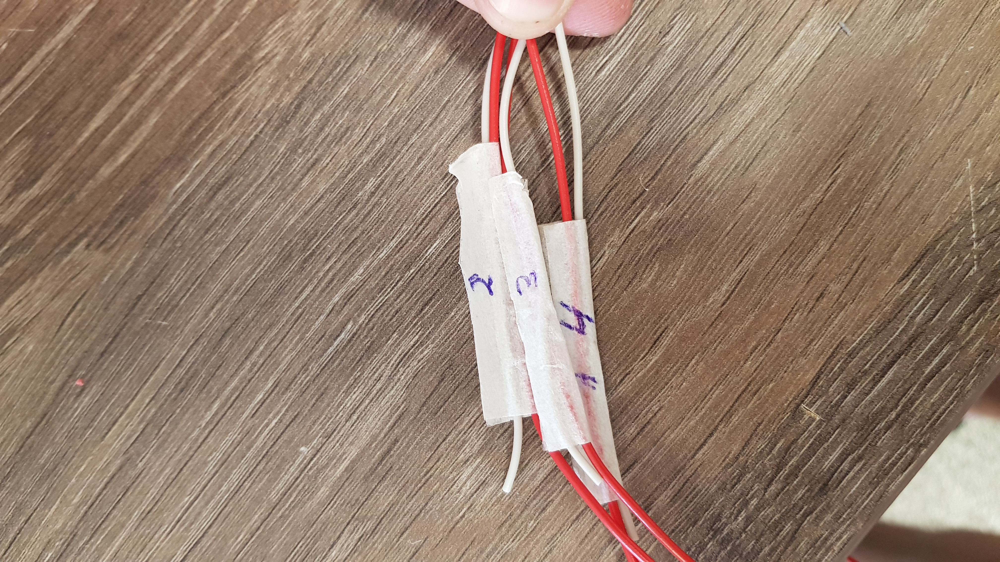

Пайка, монтаж и подключение
===========================

.. csv-table:: Инструкция по сборке концевиков
   :header: "Номер", "Наименование", "Количество", "Изображение"
   :widths: 10, 10, 30, 30

   1, "Концевик", 4, |pic1|

   1, "Провод красный 18 AWG", "500 СМ", |pic2|

   3, "Провод белый 18 AWG", "500 СМ", |pic3|

   4, "Четырехжильный монтажный провод", "600 СМ", |pic4|

   5, "Авиационный четырехканальный разъем GX16 4 pin", "4 (5 если используем отдельный бокс)", |pic5|       

Отрежьте провода следующих длин: 176, 116, 110 и 142 см красный, 107, 47, 41 и 73 см белый.

.. csv-table:: Таблица соответствий
   :header: "Красный провод, см", "Белый провод, см"
   :widths: 10, 10

   176, 107
   142, 73
   116,47
   110,41
   "", 69

Каждому концевику соответствует строка в таблице.

    

Впаяйте белый провод к ножке 1 на концевике. Красный к ножке 3.

   

Проденьте термоусадку на место пайки и нагрейте ее, пока она не усадится.

Так сделать со всеми четырьмя концевиками
Пометте провода концевиков следующим образом, как показано на картинке, чтобы в дальнейшем их не перепутать (самый длинный провод - 4 звено, самый короткий - 1 звено)

Пайка проводов шаговых двигателей
===================================

Удлините провода шаговых двигателй в соответствии с таблицей ниже.

.. csv-table:: Таблица соответствий
   :header: "Шаговый двигатель", "Длина четырехжильного провода, см"
   :widths: 5, 8

	"Nema 23 50 мм", 110
	"Nema 23 112 мм", 116
	"Nema 17 40 мм", 142
	"Nema 14 35 мм", 176